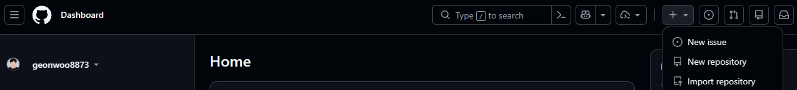
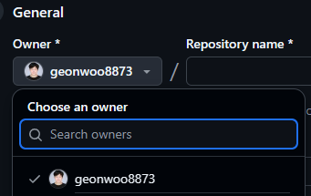
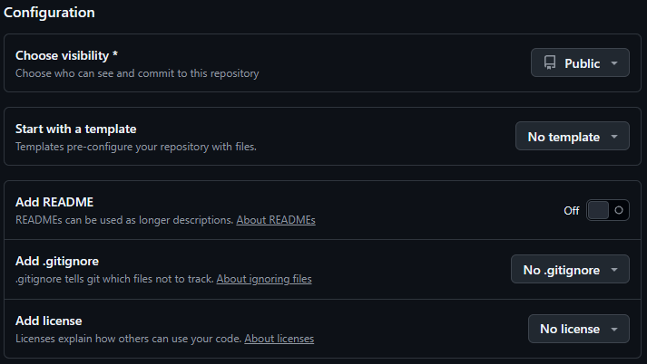
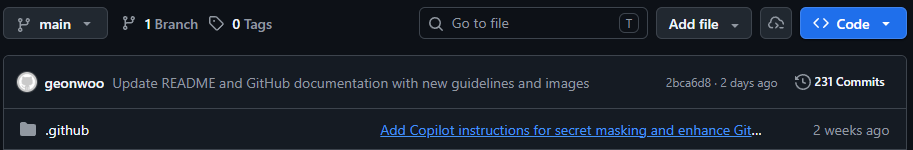
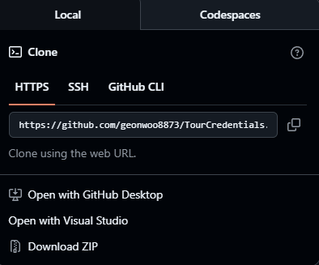
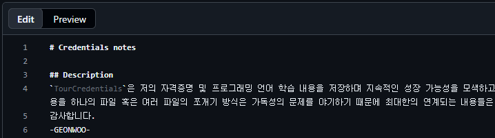
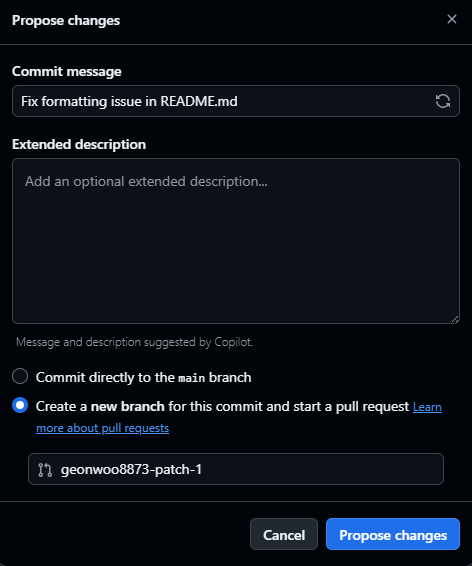

# 1. 리포지토리란? [`GH-100`, `GH-900`]

리포지토리는 모든 프로젝트 파일과 각 파일들의 수정 기록이 포함되어 사용자와 공동 작업하는 데 도움이 되는 필수 요소 중 하나이다. 리포지토리를 통해 작업을 관리하고, 변경 내용을 추적과 수정 기록을 저장하고, 다른 사용자와 작업을 할 수 있다.

## 1.1 리포지토리 생성

1. GitHub DashBoard 페이지에서 우측 상단 모서리의 드롭다운 메뉴를 사용하고 새 리포지토리(`New repository`)를 선택한다.
   
   

2. 소유자 드롭다운 메뉴를 사용하여 리포지토리에 대한 소유자의 계정을 선택한다.
   
   

3. 리포지토리의 이름과 설명(선택 사항)을 입력한다.
   
   

4. 리포지토리 표시 여부와 사전 구성 여부를 선택한다.
   
   

> [!TIP]
> **Public Repository : GitHub 내에서 공개되는 리포지토리로 외부 사용자의 기여나 혹은 자유로운 협력 방식이 적용 된다.**  
> **Private Repository : 외부 사용자로 부터 기여를 받지는 못하지만 해당 리포지토리의 소유자가 직접 협력자 등록하여 협엽 방식이 적용 된다.**
>
> **Start with a template : 리포지토리를 생성 전 구조화된 템플릿 리포지토리를 베이스로 사전 구성을 진행한다.**  
> **Add README, Add .gitignore : 리포지토리를 대표하는 커버 파일과 작업 영역의 커밋 진행 전 제외해야할 파일 혹은 디렉토리의 언어 환경을 선택 할 수 있다.**

> [!WARNING]
> **Add License : 개발 소프트웨어의 법적 자산으로서 보호를 해야 한다면 선택하는 것이 맞으나, 언어 혹은 프로젝트 및 조직에서 요구하는 라이선스가 있다면 필수로 선택해야 한다.**

## 1.2 리포지토리 복제 방법

격리된 작업 영역에서 하나의 리포지토리의 로컬 복사본을 생성할 수 있으며, 원격 리포지토리에 동기화하는 데 유용하다. 복사본 생성에 대한 과정은 다음을 수행하면 된다.

1. GitHub.com 복제하고자 하는 리포지토리의 메인 페이지로 이동한다.
2. 상단 `Add File` 드롭 다운 버튼 우측에 `Code` 드롭 다운 버튼을 선택하여 `Local`을 선택한다.

   

3. HTTPS, SSH, GitHub CLI 외 IDE에서 팔렛트 명령어나 Bash에서 해당 리포지토리의 URL을 입력하거나 선택한다. 

   

4. 파일 이름 필드에 파일 이름 및 확장명을 입력하고, 하위 디렉터리를 포함하고자 한다면 디렉터리 구분에 [`/`]를 추가하여 입력한다.

   

5. 파일 내용 텍스트 상자에 파일 의 콘텐츠를 입력하고, 새 콘텐츠를 검토하려면 파일 콘텐츠 상단에서 미리 보기[`Preview`]를 선택한다.
6. 해당 콘텐츠 편집이 완료되면 변경 사항 커밋을 선택한다.

   

7. **메시지 커밋 필드**에 파일에 대한 변경 내용을 설명하는 커밋 메시지를 입력하고, **커밋 메시지에서 커밋을 둘 이상의 작성자에게 귀속할 수 있다.**
8. **메시지 커밋 필드** 아래에서 현재 분기 또는 새 분기에 커밋을 추가할지 여부를 결정하고, 현재 분기가 기본 분기인 경우 커밋에 대한 **새 분기를 생성하도록 선택 하여 끌어오기 요청을 게시해야 한다.**

   

9. 변경 내용 커밋 또는 변경 내용 제안을 선택한다.

# 2. Gist [`GH-100`, `GH-900`]

사용자가 가볍고 편리한 방법으로 코드 조각 형태나 메모 혹은 기타 정보를 쉽게 공유할 수 있는 기능이다. 기본적으로 하나의 작은 GitHub Repository으로 포크와 복제 및 버전 제어가 가능하여, 전체 리포지토리를 생성할 필요 없이 빠른 솔루션, 구성 파일 또는 예제를 공유하는 데 특히 유용하다.

## 2.1 공개 및 비공개 Gist

> [!NOTE]
> * **Pulic Gists : 모든 사용자가 접근할 수 있으며 검색 기능 통해 검색할 수 있다. 방대한 커뮤니티에서 사용할 수 있도록 하려는 하나의 코드 조각 또는 솔루션을 공유하는 데 적합하다.**
> * **Private Gists : 검색되거나 공개적으로 표시되지는 않지만 온전히 비공개가 불가능하며, 직접 접근 가능한 URL이 있다면 모든 사용자가 액세스할 수 있기 때문에, 공동 작업자 또는 동료와 같이 제한된 대상과 코드를 공유하는 데 유용하다.**

## 2.2 버전 제어

요점에 대한 모든 변경 내용은 자동으로 추적되어 편집 기록을 즉각적으로 확인할 수 있고, 이전 버전으로 쉽게 롤백하거나 시간이 지남에 따라 코드 조각들이 어떤 방식으로 변화를 했는지 확인할 수 있다.

## 2.3 포크 및 복제

리포지토리의 일부 기능을 제공하여 포크와 클론이 가능하다. 공동 작업자나 외부 사용자가 해당 작업물을 바탕으로 변경을 하거나 필요 목적에 맞게 수정할 수 있다.

## 2.4 포함

웹 페이지 또는 블로그에 인용한 조각들을 포함할 수 있어 대부분 설명서나 코드 예제 형태로 공유하는 데 유용한 도구이다.

## 2.5 Markdown

Markdown 서식을 지원하여 코드와 함께 포함된 서식 있는 텍스트, 제목, 링크 및 이미지를 포함할 수 있기 때문에 코드 조각에 컨텍스트 또는 설명을 추가하는 데 유용하다.

## 2.6 협업

일반적으로 개별 코드 조각에 사용되지만 여러 사용자가 공유하고 공동 작업할 수도 있어 포크와 댓글를 통해 축약된 협업이 가능하다.

> [!CAUTION]
> **Gist는 어떤 방식으로도 접근이 가능한 레포지토리로 해당 스크립트나 구성 파일 내용에 암호 혹은 API 키와 같은
>  고위험 기밀 데이터를 포함하면 안된다. 또한 용도의 목적인 공유인 만큼 일부 모듈 형식의 코드나 단일 파일에 적합하여 다중 디렉터리 구조나 대규모 프로젝트에는 부적합하다.**

---
