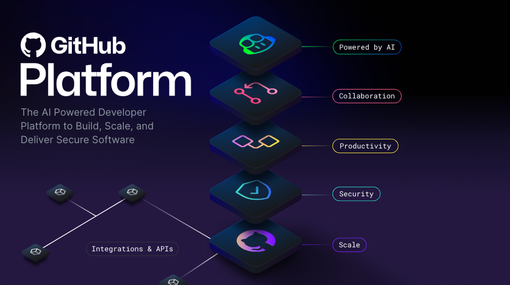
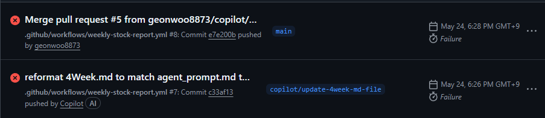

# 1. GitHub란? [`GH-100`]

출처: [Microsoft Learn](https://learn.microsoft.com/ko-kr/)

GitHub는 하나의 코드 저장소와 다양한 기능을 제공하는 플랫품으로 Git과 함께 공존하는 작업 공간이다. 분산 버전 제어 시스템인 Git이 개발자가 변경 내용을 추적하고 공동 작업하며 시간이 지남에 따라 수정 버전을 쉽게 관리할 수 있기 때문에 공동 작업 도구, 자동화 기능 사용자에게 친숙한 웹 인터페이스를 추가하여 Git을 기반으로 한다.

하나의 클라우드 기반 플랫폼으로 프로젝트에서 협업 프로세스를 간소화하고 개발자와 사용자의 협업을 허용하는 웹 사이트로, 명령줄 도구(`GitHub CLI`) 및 전체 흐름(`History`)을 제공한다. 또한 보안 소프트웨어를 빌드, 크기 조징 및 제공하는 AI 기반 개발자 플랫품을 제공하여 Enterprise 플랫폼, AI, 공동 작업, 생산성, 보안 및 규모의 핵심들은 다음을 수행한다.

## 1.2 AI

생성 AI가 소프트웨어 개발에 대한 수명 주기와 효율성을 크게 변화시키며, GitHub Enterperise 플랫폼은 AI 기반 Pull Request(PR)와 Issue를 통해 협업에 대한 프로세스를 향상 시키고, **Copilot의 Chat, Agents는 생산성을 높이는데 도우며, 보안 개선을 위한 보다 빠른 피드백을 제공해 보안을 강화할 수 있다는 이점을 제공한다.**

## 1.3 협업

GitHub내에서 수행하는 모든 작업의 중심에는 항상 협업이라는 공동 작업이 존재하여, **팀이 효율적으로 협력하여 지연을 줄이고 워크플로를 간소화 하는 데 도움이 되는 도구를 제공한다.** 리포지토리, 문제, 끌어오기 요청 및 기타 도구들은 역할 간의 빠른 공동 작업을 지원하고 승인 주기를 단축하여 배포 속도를 향상시키는 데 도움이 된다.

## 1.4 생산성

GitHub Enterprise Platform에서 제공하는 자동화를 통하 생산성이 향상된다. 개발 프로세스 단계에 직접 통합된 기본 제공되는 CI/CD(지속적인 통합 및 업데이트) 도구를 사용하면 사용자가 반복적인 작업을 자동화하고 작업을 가속화할 수 있기 때문에 이에 대한 개발자는 개발 및 문제 해결 단계에 집중할 수 있게된다. 

## 1.5 보안

처음부터 모든 단계까지의 개발 프로세스에서 직접적인 보안을 통합한다. **GitHub Enterprise에는 위험 리스크를 최소화하기 위한 CodeQL, 검사, Dependabot 및 보안 개요와 같은 자사 네이티브 기능이 포함되어 있어 코드는 비공개로 유지되지만 통합 보안 검사의 이점을 제공 받을 수 있다.** 기본적으로 높은 보안 수준 및 규정 준수에 투자를 하고 있으며, 높은 규제 산업의 Microsoft 및 조직에서 신뢰 높은 글로벌 규정 준수 표준을 준수하므로 대규모로 안전한 개발을 위한 신뢰할 수 있는 선택이다.

## 1.6 규모

수 많은 리포지토리 및 배포의 실시간 데이터를 사용하여 최대 규모의 개발자 커뮤니티로, GitHub는 제공하는 제품들을 지속적으로 학습하고 발전하고 있다. 대규모 사용자 기반은 개발자가 필요로 하는 사항에 대한 다양한 관점을 제공하여 이러한 요구하는 조건들을 충족하기 위해 지속적인 혁신을 목표로 추진하며 확장 가능한 플랫폼으로, 국적 상관없이 오픈 소스 개발자가 GitHub를 통해 높은 품질의 기능을 만들고 향상시킨다.

기본적으로 GitHub Enterprise 플랫폼은 개발자 환경에 중점으로 구성되어 통합 개발자 환경에서 생산성, 보안 및 확장성을 지원하는 협업 도구, 자동화 및 AI 기반 기능을 제공한다.

> [!NOTE]
> * **[History](GitHub-History.md)는 이벤트 기록이나 세부적인 검색을 통해 커밋 기록과 끌어오기 요청을 찾아 보다 프로젝트 관리성을 이점으로 제공한다.**
> * **GitHub CLI는 하나의 `Terminal Command Line` 형태로 웹 사이트처럼 선택하여 하는것이 아닌 문자열 타입(`String`)으로 입력값을 받아 그에 준하는 명령을 수행하는 `Command Line Interface`다.**

---

# 2. 리포지토리란? [`GH-100`, `GH-900`]

리포지토리는 모든 프로젝트 파일과 각 파일들의 수정 기록이 포함되어 사용자와 공동 작업하는 데 도움이 되는 필수 요소 중 하나이다. 리포지토리를 통해 작업을 관리하고, 변경 내용을 추적과 수정 기록을 저장하고, 다른 사용자와 작업을 할 수 있다.

## 2.1 리포지토리 생성

1. GitHub DashBoard 페이지에서 우측 상단 모서리의 드롭다운 메뉴를 사용하고 새 리포지토리(`New repository`)를 선택한다.
   
   

2. 소유자 드롭다운 메뉴를 사용하여 리포지토리에 대한 소유자의 계정을 선택한다.
   
   

3. 리포지토리의 이름과 설명(선택 사항)을 입력한다.
   
   

4. 리포지토리 표시 여부와 사전 구성 여부를 선택한다.
   
   

> [!TIP]
> **Public Repository : GitHub 내에서 공개되는 리포지토리로 외부 사용자의 기여나 혹은 자유로운 협력 방식이 적용 된다.**  
> **Private Repository : 외부 사용자로 부터 기여를 받지는 못하지만 해당 리포지토리의 소유자가 직접 협력자 등록하여 협엽 방식이 적용 된다.**
>
> **Start with a template : 리포지토리를 생성 전 구조화된 템플릿 리포지토리를 베이스로 사전 구성을 진행한다.**  
> **Add README, Add .gitignore : 리포지토리를 대표하는 커버 파일과 작업 영역의 커밋 진행 전 제외해야할 파일 혹은 디렉토리의 언어 환경을 선택 할 수 있다.**

> [!WARNING]
> **Add License : 개발 소프트웨어의 법적 자산으로서 보호를 해야 한다면 선택하는 것이 맞으나, 언어 혹은 프로젝트 및 조직에서 요구하는 라이선스가 있다면 필수로 선택해야 한다.**

## 2.2 리포지토리 복제 방법

격리된 작업 영역에서 하나의 리포지토리의 로컬 복사본을 생성할 수 있으며, 원격 리포지토리에 동기화하는 데 유용하다. 복사본 생성에 대한 과정은 다음을 수행하면 된다.

1. GitHub.com 복제하고자 하는 리포지토리의 메인 페이지로 이동한다.
2. 상단 `Add File` 드롭 다운 버튼 우측에 `Code` 드롭 다운 버튼을 선택하여 `Local`을 선택한다.

   

3. HTTPS, SSH, GitHub CLI 외 IDE에서 팔렛트 명령어나 Bash에서 해당 리포지토리의 URL을 입력하거나 선택한다. 

   

4. 파일 이름 필드에 파일 이름 및 확장명을 입력하고, 하위 디렉터리를 포함하고자 한다면 디렉터리 구분에 [`/`]를 추가하여 입력한다.

   

5. 파일 내용 텍스트 상자에 파일 의 콘텐츠를 입력하고, 새 콘텐츠를 검토하려면 파일 콘텐츠 상단에서 미리 보기[`Preview`]를 선택한다.
6. 해당 콘텐츠 편집이 완료되면 변경 사항 커밋을 선택한다.

   

7. **메시지 커밋 필드**에 파일에 대한 변경 내용을 설명하는 커밋 메시지를 입력하고, **커밋 메시지에서 커밋을 둘 이상의 작성자에게 귀속할 수 있다.**
8. **메시지 커밋 필드** 아래에서 현재 분기 또는 새 분기에 커밋을 추가할지 여부를 결정하고, 현재 분기가 기본 분기인 경우 커밋에 대한 **새 분기를 생성하도록 선택 하여 끌어오기 요청을 게시해야 한다.**

   