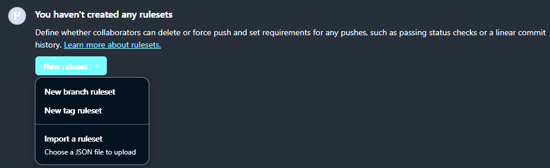

# 1. GitHub 리포지토리 규칙 집합 만들기 또는 관리 [`GH-100`]

> **GitHub 관리자는 분기 및 태그를 푸시, 삭제 또는 이름을 바꿀 수 있는 사용자를 세부적으로 제어해야 하며, 리포지토리 규칙 집합을 사용하면 여러 규칙을 단일 이름으로 번들로 묶고, 선택한 분기 또는 태그에 적용해 삭제하지 않고 설정 혹은 해제를 할 수 있다. 기존 분기 및 태그 보호 규칙을 보완하여 리포지토리 보안에 대한 통합되고 계층화된 접근 방식을 제공한다.**

## 1.2 리포지토리 규칙 집합이란?

> **`규칙 집합`은 리포지토리의 하나 이상의 분기 또는 태그에 적용되는 명명된 규칙 컬렉션이다.**

* **대상 선택** : 특정 분기(`feature/**`) 또는 태그(`v*.*`)를 선택
* **규칙 정의** : 상태 검사 필요, 서명된 커밋 적용, 강제 푸시 차단 등
* **권한 무시** : 리포지토리 관리자, 팀 또는 GitHub 앱에 특정 규칙을 무시할 수 있는 권한을 부여

#### 규칙 집합, 분기 보호 및 보호된 태그 비교

| **역량**                                  | **보호 규칙**       | **규칙 집합**        |
| ----------------------------------------- | ------------------- | -------------------- |
| **분기 또는 태그당 단일 규칙**            | Y                   | X [`N개의 규칙`]     |
| **여러 규칙 그룹이 공존**                 | X                   | Y                    |
| **삭제하지 않은 활성화 또는 비활성화**    | X                   | Y [`상태 전환 여부`] |
| **읽기 권한이 있는 모든 사용자에게 표시** | X [`관리자만 해당`] | Y                    |

#### 규칙 집합의 주요 이점

* **레이어 링** : 여러 원본에서 규칙을 집계하여 가장 엄격한 설정이 적용된다.
* **상태** : 삭제하지 않고 규칙 집합을 사용하도록 설정, 사용하지 않도록 설정 또는 평가[`테스트`] 진행한다.
* **투명성** : 개발자와 감사자가 관리자 권한이 없는 상태에서 읽기 권한이 있는 활성 규칙 집합을 확인할 수 있다.

## 1.3 첫 번째 규칙 집합 생성

1. GitHub **리포지토리 설정**(`Settings`) -> **Rules**(`Rulesets`) 이동
2. **새 규칙 집합** (`Add bypass`)을 클린한 **다음 분기** 또는 **태그**를 선택
   
3. 이름을 입력하고 **대상 브랜치** 또는 **태그**를 선택
4. **상태 확인 필요** 또는 **강제 푸시 차단 규칙**을 전환
5. **바이패스 권한**(관리자, CI App)을 할당

### 1.3.1 사용 가능한 규칙 목록

| **항목**                                      | **설명**                                                                                                                                                                                        |
| --------------------------------------------- | ----------------------------------------------------------------------------------------------------------------------------------------------------------------------------------------------- |
| **Restrict creations**                        | 우회 권한이 있는 사용자만 일치하는 참조를 생성할 수 있도록                                                                                                                                      | 한다. |
| **Restrict updates**                          | 우회 권한이 있는 사용자가 일치하는 참조를 업데이트할 수 있도록 한다.                                                                                                                            |
| **Restrict deletions**                        | 우회 권한이 있는 사용용자만 일치하는 참조를 삭제할 수 있도록 한다.                                                                                                                              |
| **Require linear history**                    | 병합 커밋이 일치하는 참조로 푸시되는 것을 방지한다.                                                                                                                                             |
| **Require deployments to succeed**            | 규칙과 일치하는 참조로 푸시하기 전에 배포가 성공적으로 완료되어야 하는 환경을 선택한다.                                                                                                         |
| **Require signed commits**                    | 일치하는 참조로 푸시되는 커밋에는 검증된 서명이 있어야 한다.                                                                                                                                    |
| **Require a pull request before merging**     | 모든 커밋은 대상이 아닌 브랜치에 작성되고 풀 리퀘스트를 통해 제출된 후에만 병합될 수 있도록 한다.                                                                                               |
| **Require status checks to pass**             | 참조가 업데이트 되기 전에 통과해야 하는 상태 검사를 선택한다. 이 옵션은 활성화하면 커밋은 먼저 검사를 통과한 다른 참조로 푸시되어야 한다.                                                       |
| **Block force pushes**                        | 푸시 권한이 있는 사용자가 참조 저장소에 강제 푸시하는 것을 방지한다.                                                                                                                            |
| **Require code scanning results**             | 참조 저장소를 업데이트하기 전에 코드 스캔 결과를 제공해야 하는 도구를 선택하고 설정된 경우, 코드 스캔이 활성되어 있어야 한다. 커밋과 업데이트되는 참조 저장소 모두에 대한 결과가 존재해야 한다. |
| **Require code quality results**              | 풀 리퀘스트 병합을 차단할 코드 품질 결과의 심각도 수준을 선택하여 설정된 경우, 변경 사항을 병합하기 전에 풀 리퀘스트에 대한 코드 품질 분석을 수행해야 한다.                                     |
| **Restrict code coverage**                    | 풀 리퀘스트에 최소 코드 커버리지 임계값을 적용하여 설정된 경우에 변경 사항을 병합하기 전에 업로드된 커버리지 데이터가 지정된 기준을 충족해야 한다.                                              |
| **Automatically request Copilot code review** | 작성자가 Copilot 코드 검토 권한이 있고 프리미엄 요청 할당량이 한도에 도달하지 않은 경우, 새 풀리퀘스트에 대해 Copilot 코드 검토를 자동으로 요청한다.                                            |

> [!WARNING]
> **`Automatically request Copilot code review`의 프리미엄 요청은 2026년 4월 부터 종량제에서 토큰제로 이로인한 요금 청구 금액이 상이할 수 있다.**

> [!TIP]
> **병합하기 전에 주요 워크플로를 상태 검사로 요구하여 CI/CD 파이프라인을 적용한다.**


# 2. 규칙 집합 및 보호 계층화 [`GH-100`]

> **GitHub는 분기 보호, 태그 보호 및 여러 규칙 집합과 같은 적용 가능한 모든 규칙을 집계하고 가장 제한적인 설정을 적용한다.**

## 2.1 GitHub Enterprise에서 정책 및 규칙 집합 선택 항목의 영향

> **정책 및 규칙 집합은 보안, 규정 준수, 개발자 환경 및 운영 효율성에 영향을 주며, 제어와 유연성 사이의 적절한 균형을 유지를 위한 목적으로 찾는 것이 필수적이다.**

#### 보안 및 규정 준수 적용

| **장점**                                                                | **단점**                                                                        |
| ----------------------------------------------------------------------- | ------------------------------------------------------------------------------- |
| **규칙 집합에 의해 적용되는 SAML SSO 및 2FA는 무단 액세스를 방지한다.** | **포크를 차단하거나 긴 승인 체인을 적용하면 개발자의 생산성이 저하될 수 있다.** |
| **분기 보호는 모든 코드 변경 내용이 검토되도록 한다.**                  | **수동 보안 검사는 관리 오버헤드를 증가시킨다.**                                |
| **감사 로깅 규칙 집합은 SOC 2 및 ISO 27001 규정 준수를 지원한다.**      |                                                                                 |

#### 개발자 생산성 및 워크플로 효율성

| **장점**                                                                 | **단점**                                                  |
| ------------------------------------------------------------------------ | --------------------------------------------------------- |
| **자동화된 검사(`Dependabot`, `코드 스캔`)는 수동 작업을 줄일 수 있다.** | **엄격한 승인 정책은 팀의 생산성을 저하 시킨다.**         |
| **보안 규칙 집합은 수동 단계 없이 규정 준수를 자동화한다.**              | **강제 푸시 차단은 긴급 핫픽스를 복잡하게 만들 수 있다.** |
| **유영한 보호 조치가 민첩성을 유지한다.**                                |                                                           |

#### 거버넌스 및 액세스 제어

| **장점**                                                         | **단점**                                                             |
| ---------------------------------------------------------------- | -------------------------------------------------------------------- |
| **가시성 규칙은 프라이빗 코드가 실수로 노출되는 것을 방지한다.** | **액세스를 과도하게 제한하면 공동 작업 병목 현상이 발생할 수 있다.** |
| **세분화된 권한은 액세스 수준을 보장한다.**                      | **오픈 소스 프로젝트에서 포크 차단은 기여를 방해한다.**              |
| **포크 제한은 지적 재산권 위험을 줄여준다.**                     |                                                                      |


#### CI/CD 및 자동화 영향

| **장점**                                                                 | **단점**                                                                |
| ------------------------------------------------------------------------ | ----------------------------------------------------------------------- |
| **상태 검사를 요구하면 배포 전에 코드의 유효성이 검사 진행된다.**        | **엄격한 CI 승인으로 인해 배포 속도가 저하되어 대응이 늦어질 수 있다.** |
| **GitHub Actions를 규칙 집합과 통합하면 규정 준수가 자동으로 적용된다.** | **타사 작업을 차단할 경우 자동화 옵션이 제한된다.**                     |
| **기본 제공 코드 검색 및 종속성 관리는 파이프라인에 보안을 포함한다.**   |                                                                         |

# 3. 누락된 자산을 조사하기 위한 GitHub 감사 로그 API [`GH-100`]

> **감사 로그는 리포지토리 삭제 또는 멤버 제거와 같은 이벤트에 대한 가시성을 제공하고, REST API 또는 GraphQL을 사용하여 쿼리 및 수정을 진행한다.**

## 3.1 누락된 자산 문제를 해결하는 단계

1. 자산(EX : `repository.deleted`) 식별
2. 감사 로그 API(REST) 쿼리
   * **REST**: `?phrase=repository.deleted`
   * **GraphQL** : `query auditLogEntries(query: "repository.deleted")`
  
   ```
   GET /orgs/{org}/audit-log?phrase=repository.deleted
   Authorization: Bearer YOUR_TOKEN
   ```
3. GraphQL을 통한 쿼리
   ```
   query {
      auditLogEntries(first: 10, query: "repository.deleted") {
         nodes {
            action
            actor { login }
            createdAt
         }
      }
   }
   ```
4. **필터 및 검사** : 관련 이벤트에 집중
5. **수정** : 자산을 복원하거나 보안 설정을 강화한다.

# 4. 보고 및 로깅 [`GH-100`]
      
> * **리포지토리 삭제 또는 실패한 워크플로 실행과 같은 예기치 않은 이벤트가 발생하면 누가, 언제, 어떻게 수행했는지에 대한 정확한 세부 정보가 필요하다. GitHub의 감사 로그는 문제 해결, 규정 준수 및 보안 조사를 위해 이 정보를 캡쳐한다.**  
> * **GitHub.com, GitHub Enterprise Server 또는 GitHub AE를 통해 감사 로그에 액세스할 수 있으며, GraphQL API 또는 REST API를 통해 감사 로그와 상호 작용하면 몇 가지 제한 사항이 있지만 특정 유형의 정보를 검색할 수 있다.**

## 4.1 로그 레코드

> **`로그 레코드`는 조직 구성원이 수행한 작업을 기록하여 조직 소유자가 사용할 수 있는 로그는 다음을 포함하여 조직에 영향을 주는 작업에 대한 정보를 제공한다.**

* 작업이 수행된 리포지토리
* 작업을 수행한 사용자
* 수행된 작업
* 작업이 수행된 국가 또는 지역
* 작업의 날짜 및 시간

#### GitHub UI를 통해 감사 로그 보기 및 내보내기

> [!WARNING]
> **GitHub Ui를 통한 감사 로그 확인 및 내보내기는 `조직` 혹은 `기업`내 설정 에서만 가능하다.**

| Qualifier        | Description          | Example value          |
| ---------------- | -------------------- | ---------------------- |
| **action**       | 동장에 의한 필터링   | team.create            |
| **actor**        | 저자별 필터링        | octocat                |
| **country**      | 국가별 필터링        | codertocat             |
| **created**      | 생성 날짜로 필터링   | 2026-08-21             |
| **operation**    | 연산별 필터링        |                        |
| **organization** | 조직별 필터링        | octo-org               |
| **repository**   | 저장소별 필터링      | octo-org/documentation |
| **token_id**     | 토큰 ID로 필터링     |                        |
| **user**         | 사용자별 필터링      |                        |
| **hashed_token** | 접근 토큰으로 필터링 |                        |

## 4.2 API를 통해 감사 로그 액세스

#### REST API (REST 애플리케이션 프로그래밍 인터페이스)

* **범위** : Enterprise Cloud(최대 90일)
* **모니터** : 설정 변경, 권한 업데이트, 팀 멤버 자격, 애플리케이션 변경 및 Git이벤트

``` sql
GET /orgs/{org}/audit-log?phrase=git.push
Authorization: Bearer YOUR_TOKEN
```

#### GraphQL API

* **범위** : Enterprise Server(최대 90일)
* **모니터** : 설정 변경, 권한 업데이트, 팀 멤버 자격, 애플리케이션 변경
* **제한** : Git 이벤트는 포함하지 않는다.

```sql
query {
  auditLogEntries(first: 20, query: "org:octo-org action:repo.cleanup") {
    nodes {
      action
      actor { login }
      createdAt
      repository { name }
    }
  }
}
```

## 4.3 감사 로그에 대한 사용 사례

* **보안 인시던트** : 비인가 액세스 또는 데이터 반출을 추적
* **규정 준수 감사** : 정책 적용 시연(`SOC 2, ISO 27001)
* **운영 문제 해결** : CI/CD 오류 또는 권한 오류를 진단
* **액세스 모니터링** : API 토큰 사용량 및 SSH/Git 작업을 검토

## 4.4 보안 및 규정 준수

* **데이터 보존** : 엔터프라이즈 클라우드에서 90일 or 서버에서 120일
* **액세스 제어** : 소유자 및 보안 관리자 한해서만 로그 확인 가능
* **IP 로깅** : 원본 IP를 기록하여 의심스러운 액세스를 검색
* **지역 규정 준수** : 데이터 처리 요구 사항을 충족

## 4.5 감사 로그 스트리밍

> **장기 스토리지를 위해 `SIEM` 플랫품으로 로그를 실시간으로 스트리밍**

1. 설정 > 감사 로그로 이동
2. 스트리밍에서 대상(AWS, GCP, Azure)을 구성
3. 이벤트가 SIEM에 도착하는지 확인

## 4.6 추가 감사 로그 유형

* **Git 활동 로그** : 푸시, 끌어오기, 병합(`phrase-git.push`)을 추적
* **API 활동 로그** : REST/GraphQL 요청(`phrase-api,request`)을 추적
* **EMU(Enterprise Managed User)** : 포함 user.login, repository.permissions_updated 등
* **토큰 사용량** : 손상된 자격 증명을 식별하기 위해 필터링(`phrase-token`)

## 4.7 GitHub 리포지토리의 주요 보안 기능

* **SECURITY.md** : 보고 프로세스 및 지원 가능한 버전을 정의
* **분기 보호** : 검토, 상태 검사 및 커밋 서명을 적용
* **Dependabot** : 자동 취약성 검색 및 업데이트
* **코드 검사** : CodeQL을 통한 연속 분석
* **비밀 검사 및 푸시 보호** : 실시간 방지 및 경고
* **보안 권고** : 권고 초안 작성, 공동 작업 및 게시
* **종속성 그래프** : 종속성을 시각화하고 검토
* **2FA 및 RBAD** : 강력한 인증 및 최소 권한을 적용

# 5. API 액세스 및 통합 [`GH-100`]

| **토큰 유형**               | **설명**                                                |
| --------------------------- | ------------------------------------------------------- |
| **PAT(개인용 액세스 토큰)** | 사용자 계정에 연결됨과 단순 스크립트로 범위가 넓다      |
| **설치 토큰**               | GitHub Apps 설치의 경우 세분화된 권한                   |
| **OAuth 토큰**              | OAuth 앱의 경우 범위가 지정된 액세스에는 최소 권한 필요 |
| **디바이스 토큰**           | 디바이스 기반 인증 흐름의 경우                          |
| **새로 고침 토큰**          | 재 인증하지 않고 만료된 토큰 갱신                       |

| **제한 유형** | **한도**           |
| ------------- | ------------------ |
| **미인증**    | 시간당 60개 요청   |
| **인증**      | 시간당 5000개 요청 |
| **앱**        | 설치에 따라 상이   |


#### API를 통한 확인

```sh
curl -H "Authorization: token YOUR_TOKEN" \
     -H "Accept: application/vnd.github.v3+json" \
     https://api.github.com/rate_limit
```

GitHub Apps는 조직 통합에 적합한 세분화된 권한을 제공하지만 PAT는 기본 스크립트에 적합하여 OAuth 앱에는 이벤트 구독이 관리와 정기적인 검토 과정에서 최소 권한이 부여 되어야 한다. 조직은 설정을 통해 신뢰할 수 없는 앱을 제한하여 보안을 강화할 수 있으며, 엔터프라이즈 관리되는 사용자는 제한된 범위의 관리되는 계정을 제공하여 규정 준수를 보장한다. 데이터 보존 정책은 조직이 규정 요구 사항에 맞게 지정된 지역에 로그를 저장하는 데 도움이 된다.

