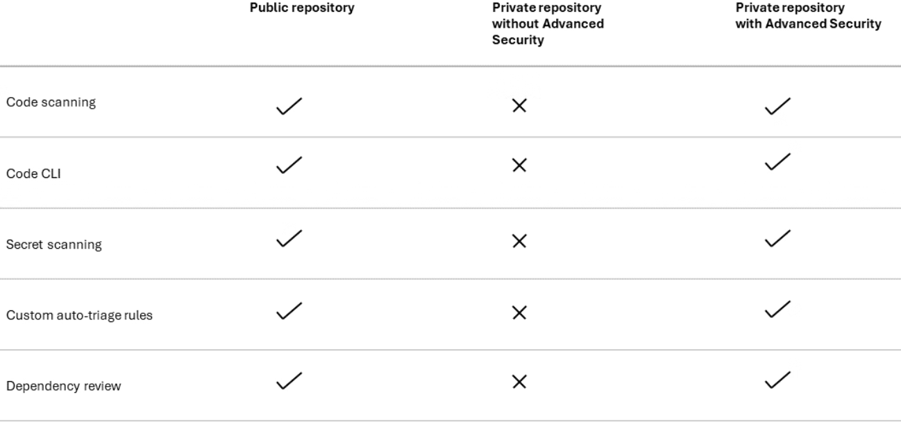
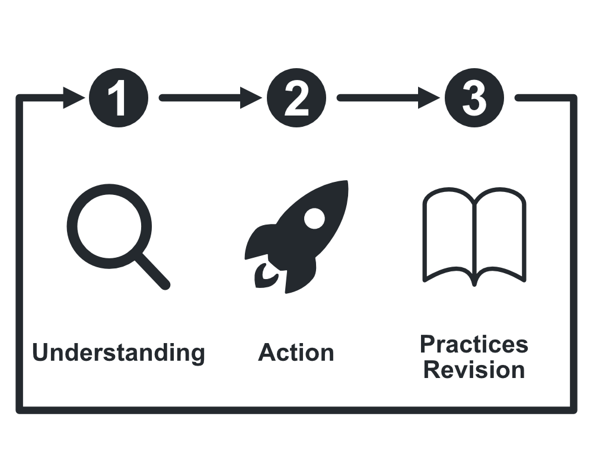

# 1. 보안 정책 설정 [`GH-100`]

보안 정책은 GitHub내 저장된 모든 리포지토리에 대한 안전한 사용을 위해 중요성이 최우선으로 지켜져야 하며, 에코시스템의 무결성을 유지한다. 이는 보안 정책이 어떤 과정을 거치며 진행되어야 하는지 혹은 설정 범위를 이해해야 하는지는 다음 세 가지의 조치가 필요하다.

1. 워크플로 안내 : 안전하고 표준화된 프로세스
2. 명확성 보고 : 취약성 공개를 위한 명확한 단계
3. 액세스 제어 : 위험을 제한하는 최소 권한 설정

> 리포지토리에서 조직이나 엔터프라이즈 수준에서 정책을 적용하여 엔터프라이즈 차원의 규칙은 균일성을 적용하고 조직 수준 설정을 사용하면 프로젝트 단위로 조정할 수 있다.

# 2. 보안 문서화 [`GH-100`]

보안 문서화는 사용자가 지원하는 버전, 문제를 보고하는 방식과 법적 고지 사항 또는 알려진 위험을 사용자에게 알릴 수 있는 `SECURITY.md`와 `기타 커뮤니티 파일`들을 통해 프로젝트의 투명성을 향상시키는 주요 커뮤니티 파일을 인식한다.

## 2.1 기타 커뮤니티 

GitHub는 프로젝트 투명성을 향상시키기 위한 주요 커뮤니티를 구성하고 외부 사용자와의 협업 표준화를 기여한다.

* 다음 목록의 파일들의 이름과 목적은 다음과 활용된다. [`권장`]
  * `CODE_OF_CONDUCT.md` : 커뮤니티 행동 표준
  * `CONTRIBUTING.md` : 기여 지침 방식
  * `DISCUSSION category forms` : 커뮤니티 토론 위한 사용자 지정 템플릿
  * `FUNDING.yml` : 스폰서 옵션 목록 표시
  * `GOVERNANCE.md` : 사용자간 의사 결정 구조 및 흐름도를 설명
  * `ISSUE / Pull Request + config.yml` : 문제 및 검토 요청 표준화
  * `README.md` : 프로젝트 소개 및 설명
  * `SUPPORT.md` : 도움말 리소스를 제공

## 2.2 보안 설정 및 적용

팀 규모에 따라 신뢰와 제어를 선택하여, 소규모 부터 대규모 까지의 광범위한 사용 권한을 사용할 수 있지만 규모가 확장될 수록 고수준의 엄격한 정책 설정 및 적용이 필요하다. 이는 계단식 구조 형태의 권한을 부여하여 사전의 리스크를 방지함을 목적으로 진행해야한다.

### 2.2.1 구성 수준

* 조직(`Org-Level`) : 설정 > 멤버 권한
* 기업(`Enterprise-Level`) : 기업 > 정책 > 저장소 정책

> [!CAUTION]
> **엔터프라이즈 규칙은 조직은 규칙을 재정의하고, 조직 소유자는 변결 불가한 설정을 임의로 설정할 수 없다.**

> [!IMPORTANT]
> **해당 기능 및 필요한 상호 작용은 리포지토리 유형과 라이선스에 따라 다르다.**

#### 구성 수준에 대한 요구되는 검증

| 특징                | 활성화 | 환경  | 감사  |     검토 / 수정      |
| ------------------- | :----: | :---: | :---: | :------------------: |
| 종속성 그래프       |   Y    |       |       |                      |
| 보안 공지           |   Y    |       |   Y   |          Y           |
| Dependabot 경고     |   Y    |       |   Y   |          Y           |
| 종속성 검토         |        |   Y   |       |          Y           |
| 스캐닝              |        |   Y   |   Y   |          Y           |
| 코드 검사[`CodeQL`] |        |   Y   |   Y   |          Y           |
| 자동 수정           |        |   Y   |       | Review generated PRs |
| 보안 캠페인         |        |   Y   |   Y   |   Coordinate teams   |

# 3. 사용 가능한 보안 도구 [`GH-100`]

모든 리포지토리는 `액세스 제어`, `SERCURITY.md`, `Dpendabot 경고 및 업데이트`, 검토에 도구를 포함하며, 고급 보안에 속하는 `코드 검사`, `비밀 검사`, `종속성 검토`가 해당된다.

## 3.1 GitHub를 사용한 엔터프라이즈 보안 강화

> GitHub의 엔터프라이즈 기능은 보안 상태 및 규정 준수를 강화한다.

* 보안 기능
  * GitHub GHAS(Advanced Security): 코드 검사, 비밀 검사, 종속성 검토
  * 보안 구성: 모든 리포지토리에서 일관된 설정 적용
* 규정 준수 지원
  * 규정 준수 보고서: 감사 및 규정 요구 사항에 사용할 수 있는 `SOC 1 ~ 2 유형 2`, `ISO/IEC 27001:2013 인증`

> [!TIP]
> * **GitHub GHAS(Advanced Security)**
>   * [GitHub GHAS Learn](https://learn.microsoft.com/en-us/credentials/certifications/github-advanced-security/?practice-assessment-type=certification)
>   * [GitHub GHAS Description](https://www.microsoft.com/en-us/securityengineering/sdl/ghas?msockid=2ea011cb2f176bae059c065e2ed76a70)
>   * GitHub는 코드의 무결성을 목표로 향상과 보존을 위해 설계된 다양한 기능을 제공하며, 기능들은 모든 제공되는 구독 요금제 플랜에 통합되어 각 의존성에 대해 라이선스 정보와 취약점 심각도를 확인할 수 있다.
>   * 취약한 의존성을 업데이트하기 위한 풀 요청[`Pull_Request`] 생성해 취약점이 있는 패키지를 사용하게되면 시스템을 침해하려는 악의적인 공격자의 쉬운 표적으로 영향을 끼칠 수 있기 때문에 `GHAS` 적용을 권장한다.
> * **SOC**
>   * -
> * **ISO/IEC 27001:2013**
>   * -

## 3.2 GitHub 리포지토리에서 중요한 데이터 스크러빙

> 기밀 데이터가 누출되면 해당 문제 부분 기록을 재작성하거나 GitHub 지원을 통해 신속하게 요청해야 한다.

### 3.2.1 기록 재작성

### 3.2.2 GitHub 지원에 문의

> 공용 리포지토리의 경우 캐시된 인덱스가 지속될 수 있다.

#### 지원 프로세스

1. 데이터가 중요한 경우 리포지토리 전체를 삭제
2. 기록 및 강제 푸시를 통한 재기록 진행
3. 리포지토리 이름, 커밋 혹은 파일 및 기록 재작성 확인을 사용해 GitHub 지원을 통한 제거를 요청하고 캐시를 플러시

#### 비밀 데이터 값 누출 방지

* `.gitignore` 사용
* `GitHub 비밀` 또는 `비밀 관리자`를 활성화하여 비밀 저장
* `GitGuraian` 또는 `TruffleHog`로 정기적으로 스캔 진행

## 3.3 보안 권고 게시

> 취약성이 발생하면 GitHub 보안 권고를 사용하여 다음을 수행한다.

* 수정 작업에 대한 비공개 공동 작업
* 세부 정보를 명확하게 전달
* 문서 완화 단계

